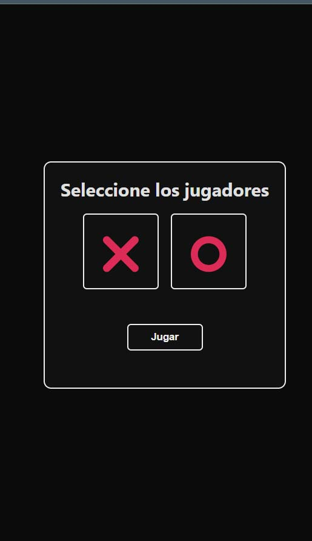
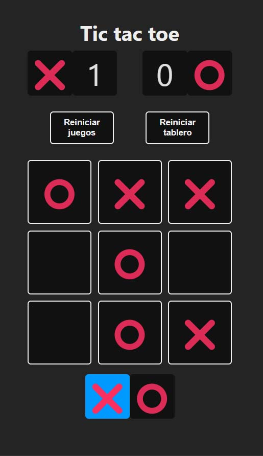
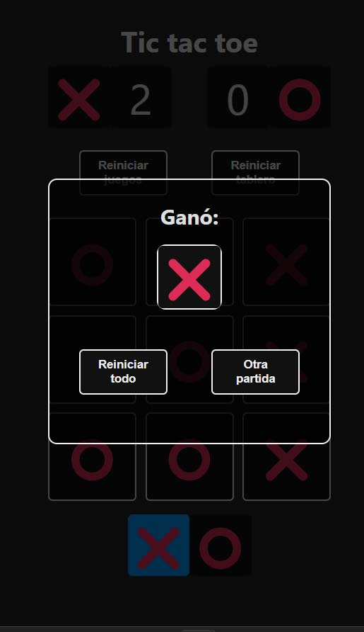

# Proyecto Tic tac toe ⚛️

Curso para aprender **React** basado en proyectos.
**[Todos los miércoles a las 18PM 🇪🇸 en Twitch de midudev](https://twitch.tv/midudev)**

Esta aplicación es una versión del clásico juego de Tic Tac Toe hecha con React Javascript usando inicialmente el codigo del segundo capitulo de Curso para aprender **React** basado en proyectos de @midudev.

Al abrir el juego, los jugadores elijen sus fichas (X o O) y luego pueden comenzar a jugar. Al no escojer ningun jugador la maquina tomara el mando de mabos jugadores y sera como un demo del juego

Las partidas se guardan instantaneamente para seguir jugando desde donde lo dejaron en otra ocasión. El juego también incluye una función de reinicio que permite a los jugadores comenzar de nuevo desde cualquier momento.

Esta aplicación de juego de Tic Tac Toe es una versión perfecta para losjugadores de todas las edades. ¡Es seguro, divertido y fácil de usar! ¡Disfruta el juego!

